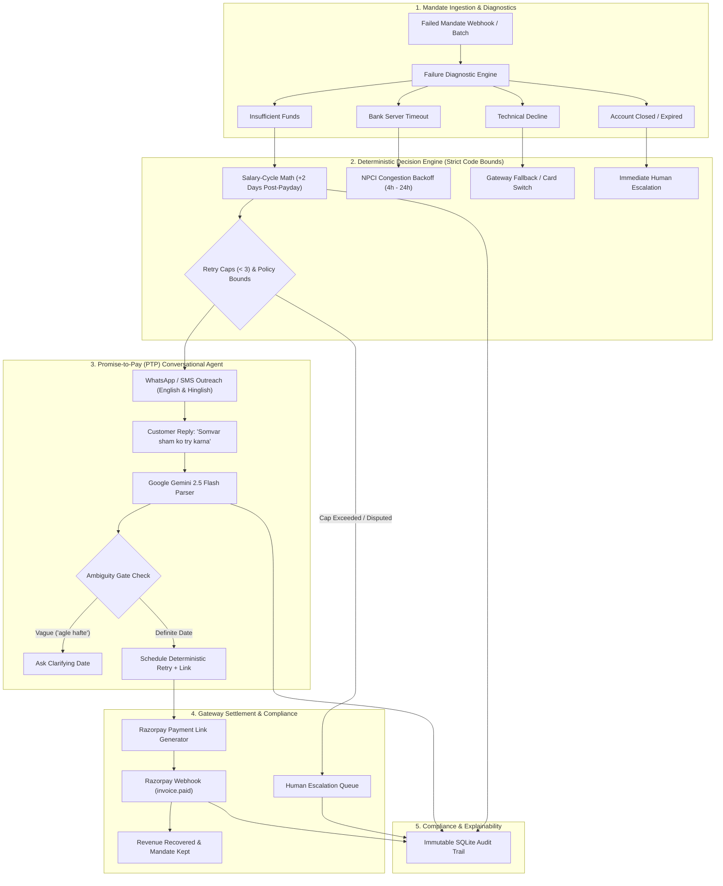

# 💳 AI Revenue Recovery Agent
### Deterministic Mandate Retry Sequencer + Dual-Language (Hinglish/English) Promise-to-Pay Loop

[](https://fastapi.tiangolo.com)
[](https://react.dev/)
[](https://vitejs.dev/)
[](https://ai.google.dev/)
[](https://razorpay.com)
[](https://www.python.org/)
[](https://opensource.org/licenses/MIT)

---

## 📌 Executive Summary & Problem Solved

In India's recurring subscription, SaaS, OTT, and lending/EMI ecosystem, businesses lose **up to 20%–30% of revenue to involuntary churn** caused by failed recurring payment mandates (**UPI Autopay, eNACH, card mandates**).

Merchants typically face two flawed extremes:
1. **Dumb, Rigid Retries:** Blasting retries immediately every 24 hours, exhausting retry caps, triggering bank bounce charges, and alienating customers.
2. **Silent Failure & Inaction:** Inaction leading to permanent subscription cancellations, bad debt, and lost lifetime customer value (LTV).

### 💡 The Solution
The **AI Revenue Recovery Agent** is a closed-loop, bounded financial intelligence system:
$$\text{Detect Failure} \longrightarrow \text{Diagnose Reason} \longrightarrow \text{Salary-Cycle Math} \longrightarrow \text{Gemini PTP Negotiation} \longrightarrow \text{Razorpay Settlement} \longrightarrow \text{Audit Log}$$

Instead of blind retries, it pairs **deterministic salary-cycle intelligence** (timing retries when customer liquidity peaks, e.g., 2 days post-payday) with an **empathetic, dual-language (English & conversational Hinglish) Promise-to-Pay (PTP) loop powered by Google Gemini 2.5 Flash**.

---

## 🏛️ System Architecture



---

## ✨ Key Features & Capabilities

### 1. 🧠 Bounded & Explainable AI (No Rogue Financial Actions)
* **Code-Enforced Bounds:** The LLM **never** decides whether to charge a card or debit a bank account. All financial operations are strictly governed by deterministic Python rules.
* **100% Explainability:** Every retry calculation, WhatsApp nudge, and state change produces an explainable audit record with confidence scores and rule IDs.

### 2. 📅 Indian Salary-Cycle Intelligence
* In India, corporate and gig-economy paydays center on the **1st, 5th, and 7th of the month**.
* If a debit fails on the 28th due to `INSUFFICIENT_FUNDS`, the engine schedules the retry for the **3rd or 7th** (+2 days salary buffer), yielding up to a **4x higher success rate** compared to next-day retries.

### 3. 💬 Dual-Language Conversational PTP Loop (English & Hinglish)
* **Powered by Google Gemini 2.5 Flash:** Parses conversational Hindi/Hinglish idioms seamlessly:
  * *"Agle Somvar pakka pay kar dunga"* $\rightarrow$ Extracted Date: Next Monday.
  * *"Salary 7th ko aayegi, tab charge kar lena"* $\rightarrow$ Extracted Date: 7th + 2 day buffer.
* **Ambiguity Gate:** If the customer is vague (*"Jaldi hi dekhunga"*), the agent detects ambiguity and politely asks for a firm estimated date rather than guessing.
* **Dynamic Language Toggle:** Instantly switch between English and Hinglish interfaces.

### 4. ⏰ Virtual Fast-Forward Simulation Clock
* Test multi-day workflows in seconds:
  * Advance time by **`+1 Day`**, **`+2 Days (Salary Buffer)`**, or **`+7 Days`**.
  * Watch scheduled retries mature, automated grace nudges fire, and payment link expiration timers trigger live on the dashboard.

### 5. 🛡️ Human-in-the-Loop Escalation Queue
* Automatic stopping rules prevent customer spam:
  * Maximum 3 automated retries per invoice.
  * Maximum 1 post-due grace nudge.
  * Instant routing to human triage for hard failures (`ACCOUNT_CLOSED`, customer disputes).
* Resolution modal allows operations staff to record manual settlement via UPI, IMPS, or write-offs.

### 6. ⚡ Live Razorpay Gateway & Webhook Simulator
* Generates live trackable Razorpay payment links.
* Built-in Webhook simulator handles events (`invoice.paid`, `payment.failed`, `subscription.charged`) to instantly reconcile state and halt unnecessary retries.

---

## 🛠️ Technology Stack

| Layer | Technologies Used |
|---|---|
| **Backend Framework** | Python 3.10+, FastAPI, Pydantic v2, Uvicorn, SQLModel / SQLAlchemy |
| **Database** | SQLite (ACID compliant, zero-config file database) |
| **LLM Engine** | Google Gemini `gemini-2.5-flash` API with structured JSON output schemas |
| **Payment Gateway** | Razorpay Recurring Mandates API + Webhooks |
| **Frontend UI** | React 18, Vite, Lucide Icons, Custom FinTech Dark Theme CSS |
| **Automated Testing** | Pytest, Pytest-Asyncio, Playwright |

---

## 📁 Repository Structure

```text
ai_revenue_recovery/
├── backend/
│   ├── app/
│   │   ├── main.py                     # FastAPI entrypoint & router registry
│   │   ├── config.py                   # Pydantic environment configuration
│   │   ├── database.py                 # SQLite session & schema lifecycle
│   │   ├── models/
│   │   │   ├── mandate.py              # Mandate & invoice data schemas
│   │   │   └── audit.py                # Compliance audit log schemas
│   │   ├── routers/
│   │   │   ├── cases.py                # Pipeline cases & status endpoints
│   │   │   ├── ptp.py                  # Promise-to-Pay chat endpoints
│   │   │   ├── clock.py                # Virtual simulation clock controls
│   │   │   ├── escalations.py          # Human triage resolution endpoints
│   │   │   └── webhooks.py             # Razorpay webhook listener
│   │   └── services/
│   │       ├── decision_engine.py      # Deterministic salary-cycle & retry math
│   │       ├── llm_service.py          # Google Gemini 2.5 Flash English/Hinglish parser
│   │       ├── clock_service.py        # Virtual clock state machine
│   │       └── razorpay_service.py     # Payment links & webhook processing
│   ├── tests/                          # 12 automated unit & integration tests
│   └── requirements.txt
├── frontend/
│   ├── src/
│   │   ├── App.jsx                     # Main dashboard container & tab router
│   │   ├── components/
│   │   │   ├── VirtualClockBar.jsx     # Fast-forward simulation clock controls
│   │   │   ├── MetricsBar.jsx          # Recovery KPI metric cards
│   │   │   ├── RecoveryPipeline.jsx    # Live mandate cases table
│   │   │   ├── PTPChatDrawer.jsx       # Hinglish/English conversational drawer
│   │   │   ├── AuditTrailDrawer.jsx    # Compliance timeline explainability modal
│   │   │   ├── HumanEscalations.jsx    # Human-in-the-loop triage table
│   │   │   └── WebhooksConsole.jsx     # Live Razorpay webhook simulator
│   │   └── index.css                   # Modern minimalist dark theme styling
│   ├── package.json
│   └── vite.config.js
├── docs/                               # In-depth architectural documentation
└── README.md
```

---

## 🚀 Quick Start Guide

### Prerequisites
* **Python 3.10+**
* **Node.js 18+** & **npm**
* *(Optional)* **Google Gemini API Key** (for live AI conversational parsing; built-in deterministic fallback active if key is not provided)

---

### 1. Backend Setup

```bash
cd backend

# Create virtual environment
python -m venv venv

# Activate virtual environment
# Windows:
.\venv\Scripts\activate
# Linux/macOS:
source venv/bin/activate

# Install dependencies
pip install -r requirements.txt

# Configure environment variables
# Edit backend/.env:
# GEMINI_API_KEY=your_gemini_api_key_here
# RAZORPAY_KEY_ID=your_razorpay_key_id
# RAZORPAY_KEY_SECRET=your_razorpay_key_secret

# Start FastAPI backend server
uvicorn app.main:app --reload --port 8000
```
Backend will be live at: `http://localhost:8000`  
Interactive API Docs (Swagger): `http://localhost:8000/docs`

---

### 2. Frontend Setup

Open a new terminal:
```bash
cd frontend

# Install npm dependencies
npm install

# Start Vite development server
npm run dev
```
Frontend dashboard will be live at: `http://localhost:5173`

---

## 🧪 Running Automated Tests

### Backend Unit & Integration Tests (12 Test Cases)
```bash
cd backend
pytest -v tests/
```
*Validates salary-cycle math, Gemini prompt parsing, retry bounds, virtual clock transitions, and webhook idempotency.*

---

## 📑 API Reference Summary

| Method | Endpoint | Description |
|---|---|---|
| `POST` | `/api/simulation/seed` | Ingests 15 realistic mandate failure scenarios across Indian banks |
| `GET` | `/api/cases` | Retrieves active mandate recovery pipeline with metrics |
| `POST` | `/api/clock/advance` | Advances virtual simulation time (`+1d`, `+2d`, `+7d`) |
| `POST` | `/api/ptp/chat` | Processes customer English/Hinglish message via Google Gemini |
| `POST` | `/api/ptp/simulate-payment` | Simulates customer clearing invoice via Razorpay payment link |
| `GET` | `/api/audit/{case_id}` | Retrieves immutable audit trail with rule explainability |
| `POST` | `/api/escalations/resolve` | Records manual resolution on escalated triage case |
| `POST` | `/api/webhooks/razorpay` | Receives and validates Razorpay webhook payloads |

---

## 📜 Compliance & Safety Standards

1. **RBI Circular on Fair Practices:** Strict cap of maximum 3 automated retry attempts per billing cycle.
2. **No Hallucinations on Monetary Values:** The LLM is restricted to classification and date extraction; monetary charges are strictly hard-coded to original invoice records.
3. **Audit Trail Immutability:** Every transition records timestamp, previous status, new status, trigger source, and machine-readable rule code.

---

## 📄 License
This project is open-source under the [MIT License](LICENSE).
