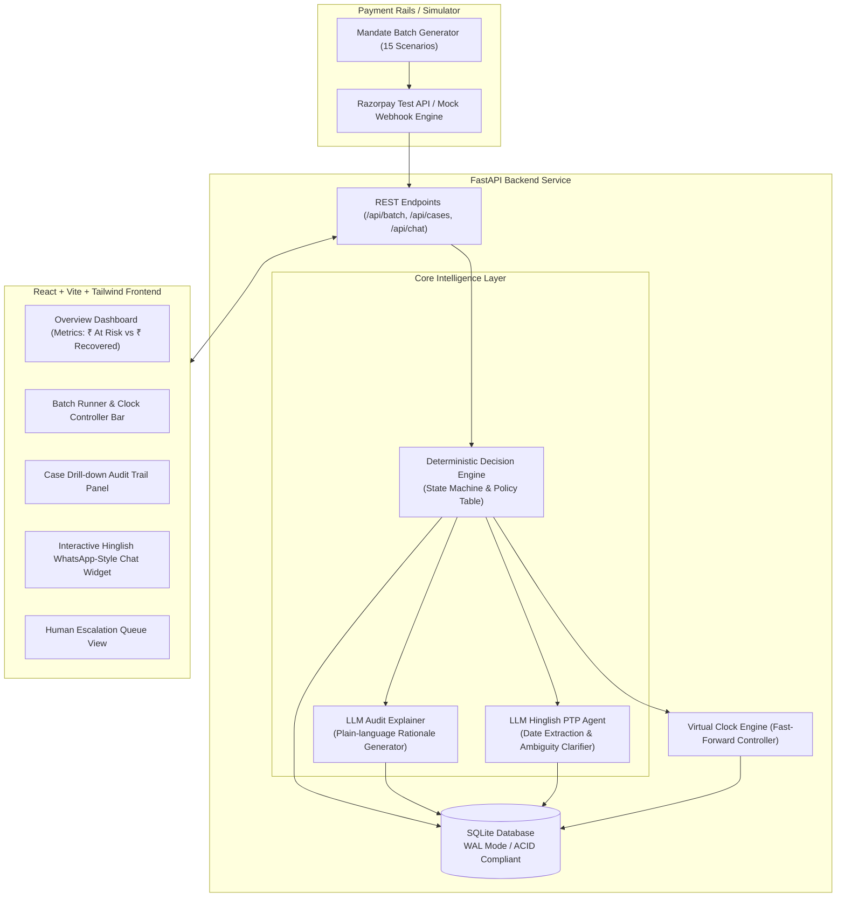

# 01. Overview and System Architecture

## 1. Problem Definition & Market Need

Recurring payment mandates (UPI Autopay, e-NACH, and recurring debit/credit cards) power modern subscription businesses, OTT platforms, SaaS, and digital lending/EMI collection in India.

However, recurring mandates fail regularly for distinct reasons:
1. **Insufficient Funds (`insufficient_funds`):** Customer's balance is temporarily low before payday.
2. **Transient Banking Outages (`bank_timeout`, `technical_decline`):** Temporary server/switch downtime at the issuing bank or NPCI.
3. **Authorization Invalidation (`mandate_expired`):** The underlying mandate authorization has lapsed.
4. **Permanent Account Termination (`account_closed`):** The bank account has been shut down.

### The Status Quo vs. AI Revenue Recovery
| Strategy | Mechanism | Consequences |
| :--- | :--- | :--- |
| **Blind Retries** | Retrying automatically at fixed intervals (e.g. daily for 5 days) | Wastes bank retry limits, incurs bank bounce penalty fees (₹250-₹500 per bounce), risks merchant blacklisting. |
| **Passive Inaction** | Not attempting recovery or sending generic emails | Revenue permanently lost, high customer churn rate. |
| **Unbounded AI Agent** | Handing an LLM unrestricted agency to call APIs | Hallucinations, spamming customers, unauthorized retries, compliance violations. |
| **This Project (Bounded Recovery)** | **Deterministic Rules + Gated LLM + Auditing** | **Maximizes liquidity-timed recovery, bounded retries, natural Hinglish PTP, and clean escalation.** |

---

## 2. Core Philosophy: Bounded, Explainable & Gated AI

The system operates on three foundational design tenets:

```
┌─────────────────────────────────────────────────────────────┐
│                 1. DETERMINISTIC POLICY                     │
│  Hardcoded Python Decision Engine determines ALL actions.   │
│  Enforces strict caps: Max 3 retries, Max 1 grace nudge.    │
└──────────────────────────────┬──────────────────────────────┘
                               │
                               ▼
┌─────────────────────────────────────────────────────────────┐
│                   2. GATED LLM LAYER                        │
│  Only used for:                                             │
│  - Hinglish Conversation & Ambiguity Resolution             │
│  - Date Extraction (e.g. "somvar ko" -> ISO Date)          │
│  - Generating Explainable Audit Reasoning                   │
└──────────────────────────────┬──────────────────────────────┘
                               │
                               ▼
┌─────────────────────────────────────────────────────────────┐
│                 3. IMMUTABLE AUDIT TRAIL                    │
│  Every decision, timing rationale, and outcome is logged.    │
│  Provides compliance transparency for financial audits.     │
└─────────────────────────────────────────────────────────────┘
```

---

## 3. End-to-End System Architecture



---

## 4. Key Subsystems Breakdown

### A. The Deterministic Decision Engine
A state machine that processes failure events. It queries the customer's profile (e.g., `salary_credit_day`), checks the previous attempt history, and routes to either:
1. **Intelligent Retry:** Near payday (`salary_credit_day + 2 days`) or next day for technical glitches.
2. **Promise-to-Pay (PTP) Flow:** When retries cannot help (expired mandate) or are exhausted.
3. **Immediate Escalation:** When accounts are closed.

### B. The Conversational Hinglish PTP Loop
When routed to PTP:
1. Sends an initial nudge in friendly Hinglish with the exact outstanding amount.
2. Customer responds in free text (English, Hindi, or Hinglish).
3. The LLM extracts the target date.
4. If ambiguous (e.g., *"kuch dino mein de dunga"*), the agent sends **one** polite clarifying question.
5. On receiving a definite commitment, a trackable Payment Link is issued.

### C. The Virtual Clock & Simulation Controller
In real life, retry cycles span days or weeks. The virtual clock allows demo operators and judges to jump forward in time (`+1 Day`, `+7 Days`, `Jump to Date`) to trigger:
- Execution of scheduled retries.
- Expiration of payment links.
- Firing of the single grace nudge.
- Triggering of human escalation when promises are broken.

### D. Real-Time React Dashboard
A modern FinTech UI displaying live metrics (Recovered vs. At Risk), interactive batch simulation, audit drawer with chronological timestamps and LLM rationale, and live customer chat testing.
