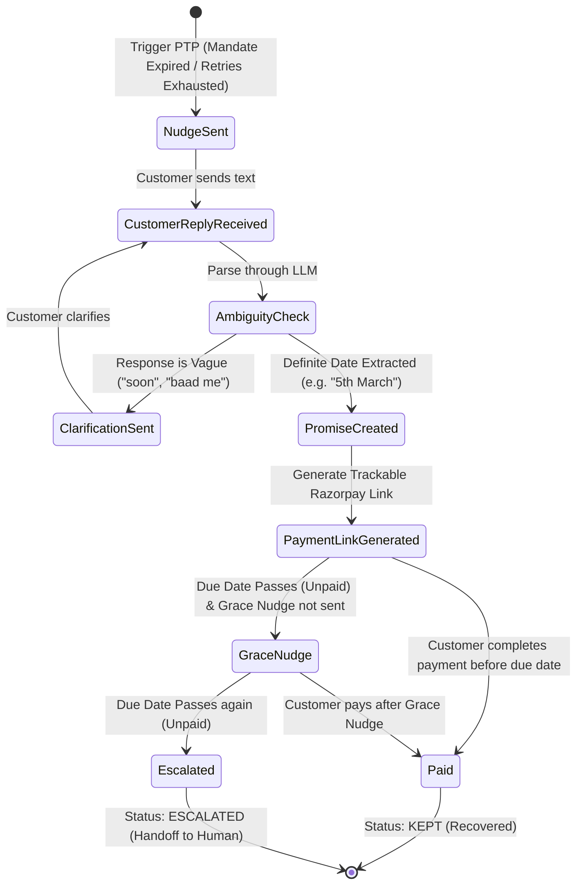

# 02. Features & Functional Specifications

## 1. Feature Breakdown Matrix

| Feature | Primary Goal | Implementation Mechanism | User Impact / Value |
| :--- | :--- | :--- | :--- |
| **Intelligent Mandate Retry Sequencer** | Recover funds without burning bank attempts | Salary-cycle arithmetic & transient glitch detection | Maximizes probability of funds availability; avoids bank penalties |
| **Conversational Hinglish PTP Loop** | Negotiate commitments when auto-debit fails | LLM date parser + Hinglish conversational agent | High empathy, zero friction recovery via conversational payment links |
| **Ambiguity Resolution Gate** | Prevent incorrect promise dates from vague replies | Single clarification turn guardrail | Ensures zero hallucinated commitments |
| **Strict Stopping Rules & Escalation** | Prevent infinite harassment & ensure compliance | Hard caps (max 3 retries, max 1 grace nudge) | Compliant, auditable, and human-in-the-loop |
| **Virtual Fast-Forward Clock** | Enable rapid evaluation of time-dependent workflows | In-memory & DB simulated timestamp manager | Instant testing of multi-week recovery journeys |
| **Case Drill-Down Audit Trail** | 100% transparent explainability for compliance | Chronological timeline + LLM reasoning cards | Auditable trail for risk, legal, and operations teams |
| **Human Escalation Queue** | Clean handoff of exhausted cases | Structured triage view with prior history context | Support agents take over with complete context |

---

## 2. Detailed Functional Specifications

### 2.1 Batch Simulation & Pre-Seeded Scenarios
The system loads a diverse batch of **15 simulated mandate failure cases** covering the entire spectrum of real-world recovery challenges:

1. **Case 1–5 (Insufficient Funds - Varied Salary Dates):**
   - Customer salary credited on 1st, 5th, 15th, 25th.
   - Initial failure on 28th $\rightarrow$ Sequencer schedules retry on salary day $+ 2$ days buffer.
2. **Case 6–8 (Transient Technical Glitches):**
   - Bank timeout or technical decline $\rightarrow$ Retry scheduled for the next calendar day.
3. **Case 9–10 (Mandate Expired):**
   - Mandate authorization lapsed $\rightarrow$ Bypasses retry entirely, initiates Promise-to-Pay flow.
4. **Case 11–12 (Account Closed):**
   - Bank account closed $\rightarrow$ Zero retries, zero PTP nudges; routed immediately to Human Escalation.
5. **Case 13–14 (Broken Promise with Recovery):**
   - PTP negotiated $\rightarrow$ Promised date passes without payment $\rightarrow$ 1 Grace Nudge sent $\rightarrow$ Customer pays via payment link $\rightarrow$ Marked `recovered`.
6. **Case 15 (Broken Promise to Escalation):**
   - PTP negotiated $\rightarrow$ Promised date passes $\rightarrow$ Grace nudge sent $\rightarrow$ Remains unpaid $\rightarrow$ Mandatory escalation to Human Queue; agent stops.

---

### 2.2 Promise-to-Pay (PTP) Conversational Engine

#### Dialogue State Machine


#### Hinglish Conversational Tone
The agent speaks in courteous, contextual Hinglish:
* **Initial Nudge:**
  > *"Namaste Rahul ji, aapka ₹499 ka recurring subscription payment process nahi ho paya. Kya aap bata sakte hain ki aap kab tak pay kar payenge?"*
* **Ambiguity Clarification:**
  > *"Dhanyawad! Kya aap koi specific tareekh bata sakte hain (jaise ki 5th March ya agle somvar), taaki hum tab tak link active rakhein?"*
* **Promise Confirmation:**
  > *"Shukriya! Humne 5th March ka promise note kar liya hai. Aap is link se direct pay kar sakte hain: https://rzp.io/l/rec_xyz"*
* **Grace Nudge:**
  > *"Namaste Rahul ji, aapne aaj (5th March) payment karne ka commitment diya tha. Kripya is link se complete karein taaki service uninterrupted rahe."*

---

### 2.3 Frontend User Interface Screens

```
┌─────────────────────────────────────────────────────────────────────────────┐
│ 🚀 AI REVENUE RECOVERY AGENT   [ 🕒 Virtual Clock: 2026-09-01 10:00 AM ]   │
│                                [+1 Day]  [+3 Days]  [+7 Days]  [Reset]      │
├─────────────────────────────────────────────────────────────────────────────┤
│ 📊 METRICS BAR                                                              │
│ [ ₹42,500 Total At Risk ]   [ ₹28,400 Recovered (66.8%) ]   [ 4 Escalated ] │
├─────────────────────────────────────────────────────────────────────────────┤
│ 🔄 ACTIONS:  [ ▶ Run Batch (15 Cases) ]   [ 📥 Export Audit Log ]          │
├─────────────────────────────────────────────────────────────────────────────┤
│ 📋 LIVE RECOVERY PIPELINE TABLE                                             │
│ Customer   | Amount  | Failure Reason     | Current Status | Next Action    │
│ ────────── | ─────── | ────────────────── | ────────────── | ────────────── │
│ Rahul S.   | ₹4,999  | insufficient_funds | RETRY_PENDING  | Retry on Sep 3 │
│ Priya M.   | ₹1,299  | mandate_expired    | PTP_ACTIVE     | Awaiting Date  │
│ Amit K.    | ₹999    | bank_timeout       | RECOVERED      | Success (Ret.1)│
│ Sneha R.   | ₹2,499  | account_closed     | ESCALATED      | Human Queue    │
├─────────────────────────────────────────────────────────────────────────────┤
│ 🗂️ DRAWER 1: Case Audit Drilldown   │ 💬 DRAWER 2: Live Hinglish Roleplay Chat │
│  - 09:00 Mandate Failed            │  Bot: Aap kab pay kar payenge?          │
│  - 09:01 Rule Triggered: Max Retries│  User: agle somvar pakka                │
│  - 09:01 LLM Explainer: Routed PTP │  Bot: Promise saved for 2026-09-08!     │
└─────────────────────────────────────┴─────────────────────────────────────────┘
```
