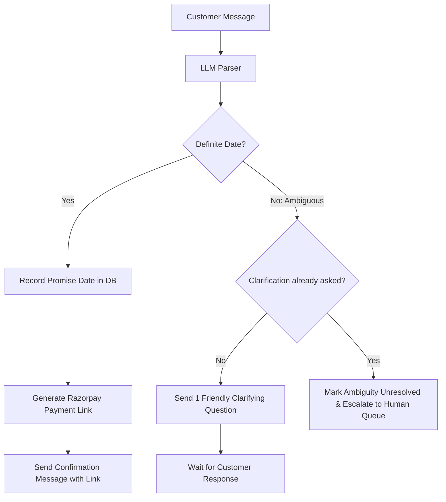

# 04. LLM Integration & Promise-to-Pay (PTP) Flow

## 1. Role of LLMs in the System

In this architecture, the LLM is **bounded and task-specific**. It performs exactly two functions:
1. **Natural Language Understanding (Hinglish PTP Extraction):** Extracts structured commitments (`date`, `amount`, `ambiguity_status`) from customer messages.
2. **Explainability Generation:** Synthesizes human-readable audit summaries for compliance logging.

---

## 2. Conversational Hinglish Promise-to-Pay Agent

When a case is routed to PTP, the conversational loop begins.

### 2.1 Prompt Engineering for Date Extraction
The LLM receives the customer's conversational reply, the current simulated date, and the outstanding balance, and outputs a strict JSON schema.

#### Extraction System Prompt
```text
You are an expert AI Revenue Recovery NLU parser specialized in Indian English, Hindi, and Hinglish.

Your objective: Parse customer messages regarding a payment reminder and extract their payment commitment date.

Today's Date: {current_simulated_date} (Format: YYYY-MM-DD, Day: {day_of_week})
Due Amount: ₹{amount}

Rules:
1. If the customer specifies a clear date (e.g., "5th ko de dunga", "agle somvar", "next Friday", "kal subah"), calculate the exact target ISO date (YYYY-MM-DD).
2. If the customer's response is AMBIGUOUS or VAGUE (e.g., "jaldi kar dunga", "dekhunga", "salary aane do", "thode din me"), set "is_ambiguous": true and provide a clarifying question in Hinglish.
3. NEVER guess an exact date if the customer was vague.
4. If the customer explicitly refuses to pay (e.g., "nahi dena", "cancel my subscription"), set "refused": true.

Return ONLY a valid JSON object matching this schema:
{
  "has_commitment": boolean,
  "is_ambiguous": boolean,
  "promised_date": "YYYY-MM-DD" | null,
  "confidence": float (0.0 to 1.0),
  "clarification_message": string | null,
  "confirmation_message": string | null
}
```

### 2.2 Few-Shot Examples for Indian Contexts

| Customer Input | Simulated "Today" | Parsed Output |
| :--- | :--- | :--- |
| *"Kal subah pakka pay kar dunga"* | `2026-09-01` (Tue) | `{"has_commitment": true, "promised_date": "2026-09-02", "is_ambiguous": false}` |
| *"Agle Somvar salary aayegi tab karta hu"* | `2026-09-01` (Tue) | `{"has_commitment": true, "promised_date": "2026-09-07", "is_ambiguous": false}` |
| *"Bhai 10 tareekh ko done"* | `2026-09-01` (Tue) | `{"has_commitment": true, "promised_date": "2026-09-10", "is_ambiguous": false}` |
| *"Jaldi karta hu thoda busy hu"* | `2026-09-01` (Tue) | `{"has_commitment": false, "is_ambiguous": true, "clarification_message": "Dhanyawad! Kya aap koi anumaanit tareekh bata sakte hain jaise 5th September?"}` |
| *"Nahi dunga, paise kat gaye the pehle bhi"* | `2026-09-01` (Tue) | `{"has_commitment": false, "refused": true, "clarification_message": null}` |

---

## 3. Ambiguity Resolution & The "Single Clarification" Gate

To prevent endless back-and-forth loops, the system enforces a **single clarification rule**:



---

## 4. Grace Nudge & Stopping Rule Flow

Once a promise date is registered (e.g. promised for `2026-09-05`):

1. **Virtual Clock reaches `2026-09-05`:**
   - If payment webhook received $\rightarrow$ Status: `kept`, Amount recovered logged.
   - If unpaid:
     - Check `grace_nudge_sent`:
       - If `False` $\rightarrow$ Send **Grace Nudge**:
         > *"Namaste Rahul ji, aapne aaj ₹499 pay karne ka commit kiya tha. Kripya is link se complete karein: https://rzp.io/l/rec_123"*
         - Set `grace_nudge_sent = True`.
2. **Virtual Clock reaches `2026-09-06` (Post-Grace):**
   - If still unpaid:
     - Status: `escalated`.
     - Log action `escalated_broken_promise` to `audit_log`.
     - **STOP all automated agent action.** Case enters Human Escalation Queue.

---

## 5. Explainability Prompt (Audit Log Explainer)

When an event occurs (e.g., retried, routed to PTP, escalated), an LLM prompt synthesizes an audit summary for compliance officers:

```text
You are a Compliance & Risk Explainer AI.
Generate a concise, professional, 1-2 sentence explanation of the system's action.

Input:
- Event: {event_type}
- Failure Reason: {failure_reason}
- Attempt Number: {attempt_number}
- Customer Salary Date: {salary_day}
- Target Date: {target_date}

Example output:
"Mandate charge failed due to insufficient funds (Attempt 1/3). In accordance with liquidity optimization policy, retry scheduled for 2026-09-03, two days post customer's salary credit date (1st)."
```
