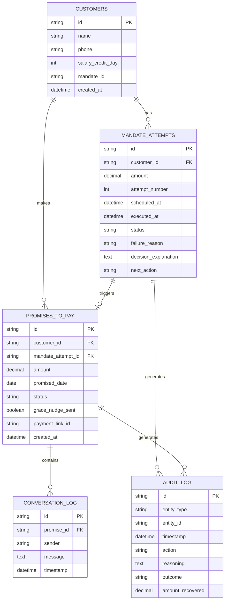

# 05. Data Models & Database Architecture

## 1. Database Choice: SQLite (ACID Compliant, Zero-Config)

For development, testing, and hackathon demonstration, SQLite is chosen for:
- Zero external infrastructure dependencies.
- Full transactional integrity (WAL mode).
- Immediate porting to PostgreSQL in production via SQLAlchemy / SQLModel.

---

## 2. Entity-Relationship Diagram (ERD)



---

## 3. Detailed Table Definitions & SQLAlchemy Models

### 3.1 `customers` Table
Represents customer entities holding recurring payment mandates.

```python
from datetime import datetime
from sqlalchemy import Column, String, Integer, DateTime
from app.database import Base

class Customer(Base):
    __tablename__ = "customers"

    id = Column(String, primary_key=True, index=True)
    name = Column(String, nullable=False)
    phone = Column(String, nullable=False)
    salary_credit_day = Column(Integer, nullable=False)  # 1 - 28
    mandate_id = Column(String, unique=True, nullable=False)  # e.g., "mandate_rzp_001"
    created_at = Column(DateTime, default=datetime.utcnow)
```

---

### 3.2 `mandate_attempts` Table
Tracks every execution and retry attempt of a mandate charge.

```python
from sqlalchemy import Column, String, Integer, Float, DateTime, ForeignKey, Text

class MandateAttempt(Base):
    __tablename__ = "mandate_attempts"

    id = Column(String, primary_key=True, index=True)
    customer_id = Column(String, ForeignKey("customers.id"), nullable=False)
    amount = Column(Float, nullable=False)
    attempt_number = Column(Integer, default=1)
    scheduled_at = Column(DateTime, nullable=False)
    executed_at = Column(DateTime, nullable=True)
    
    # Enums: "pending", "success", "failed"
    status = Column(String, default="pending")
    
    # Enums: "insufficient_funds", "mandate_expired", "bank_timeout", "account_closed", "technical_decline"
    failure_reason = Column(String, nullable=True)
    
    decision_explanation = Column(Text, nullable=True)
    
    # Enums: "retry_scheduled", "route_to_ptp", "give_up", "escalate"
    next_action = Column(String, nullable=True)
```

---

### 3.3 `promises_to_pay` Table
Manages the negotiated payment commitments.

```python
from sqlalchemy import Column, String, Float, Date, DateTime, Boolean, ForeignKey

class PromiseToPay(Base):
    __tablename__ = "promises_to_pay"

    id = Column(String, primary_key=True, index=True)
    customer_id = Column(String, ForeignKey("customers.id"), nullable=False)
    mandate_attempt_id = Column(String, ForeignKey("mandate_attempts.id"), nullable=True)
    amount = Column(Float, nullable=False)
    promised_date = Column(Date, nullable=False)
    
    # Enums: "open", "kept", "broken", "escalated"
    status = Column(String, default="open")
    
    grace_nudge_sent = Column(Boolean, default=False)
    payment_link_id = Column(String, nullable=True)
    created_at = Column(DateTime, default=datetime.utcnow)
```

---

### 3.4 `audit_log` Table
The immutable compliance trail powering drilldown and reporting.

```python
class AuditLog(Base):
    __tablename__ = "audit_log"

    id = Column(String, primary_key=True, index=True)
    entity_type = Column(String, nullable=False)  # "mandate_attempt" | "promise_to_pay"
    entity_id = Column(String, nullable=False, index=True)
    timestamp = Column(DateTime, default=datetime.utcnow)
    
    # "retry_scheduled" | "nudge_sent" | "grace_nudge_sent" | "escalated" | "recovered"
    action = Column(String, nullable=False)
    
    reasoning = Column(Text, nullable=False)
    
    # "pending" | "success" | "failure" | "escalated"
    outcome = Column(String, nullable=False)
    
    amount_recovered = Column(Float, nullable=True)
```

---

### 3.5 `conversation_log` Table
Stores conversational turns for Promise-to-Pay chat threads.

```python
class ConversationLog(Base):
    __tablename__ = "conversation_log"

    id = Column(String, primary_key=True, index=True)
    promise_id = Column(String, ForeignKey("promises_to_pay.id"), nullable=False, index=True)
    sender = Column(String, nullable=False)  # "agent" | "customer"
    message = Column(Text, nullable=False)
    timestamp = Column(DateTime, default=datetime.utcnow)
```
